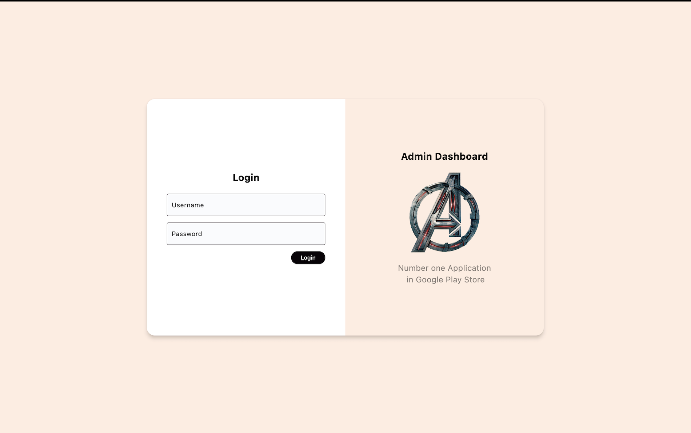
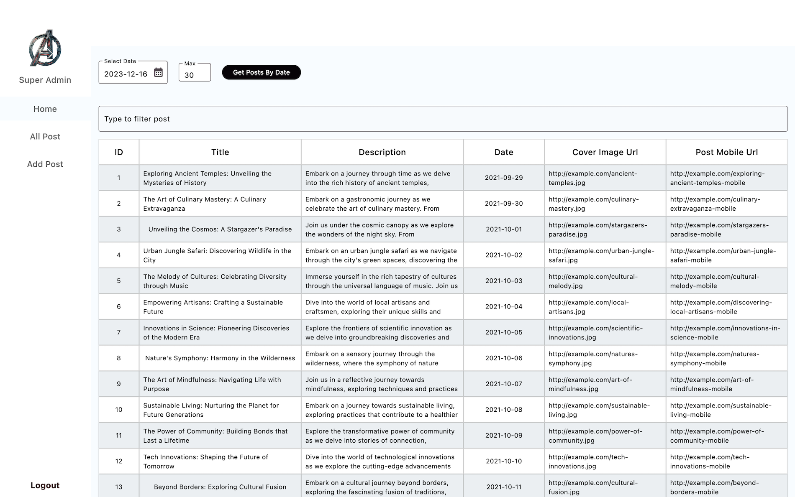
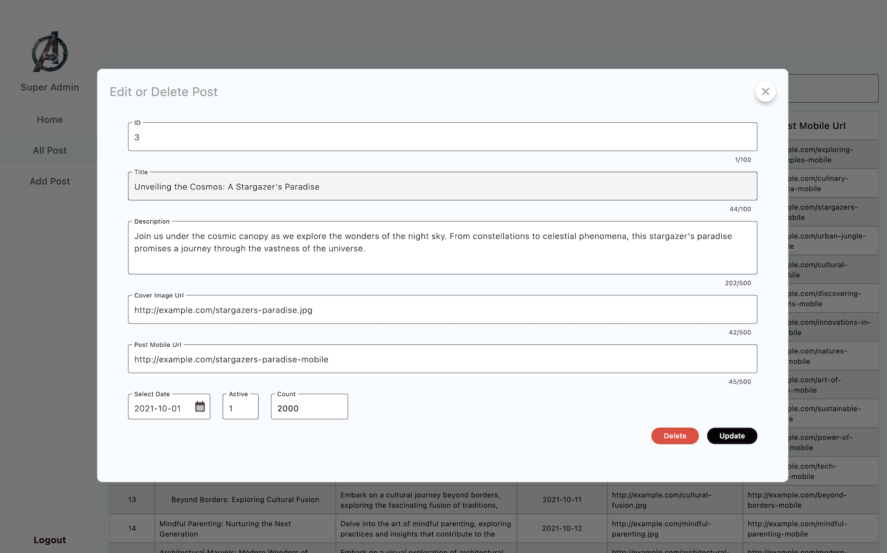
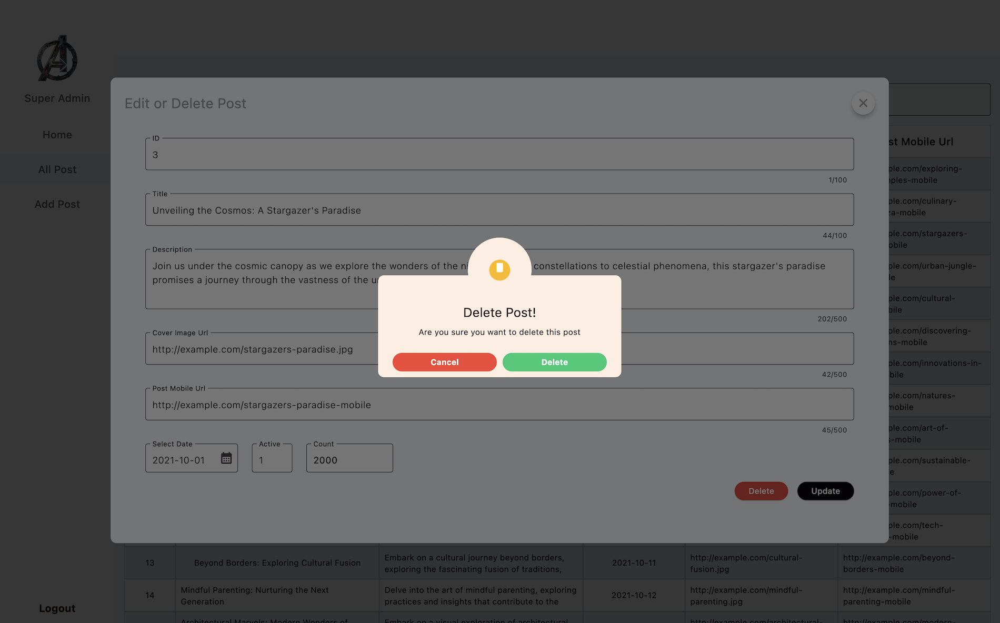
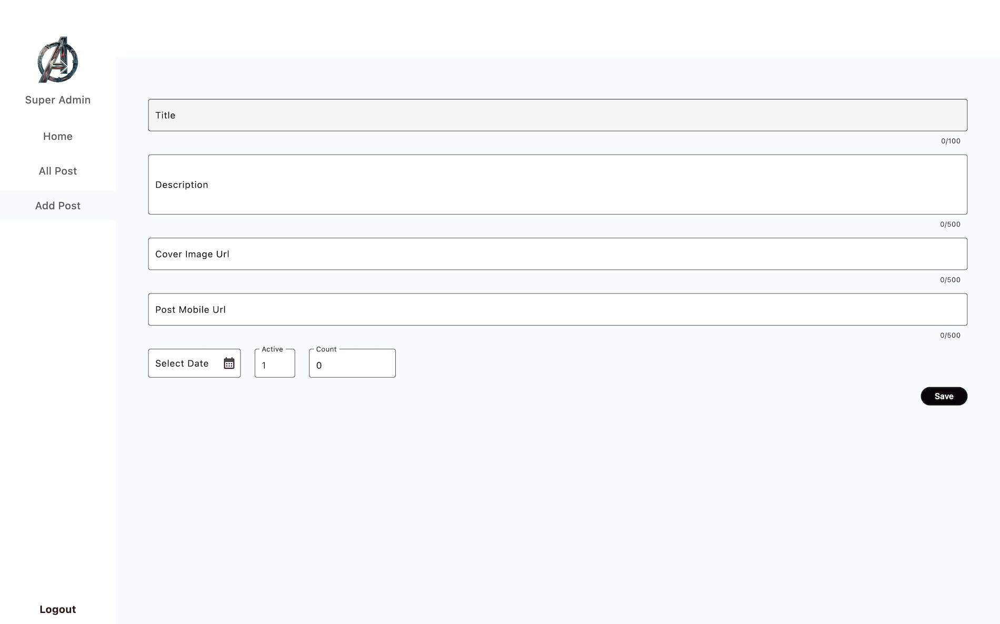

# admin_dashboard

A simple admin dashboard build with Flutter.
I had an old react dashboard. Recently, I want to do some changes on it and aslo the previous design was not responsive. Again, I developed the
new api using SpringBoot. Hence, I need to change the api request format as well. So I was thinking, why not build with Flutter as I can access it
from my Mac as a regular mac OS application and aslo as a web application.
However I was little bit confused regarding the performance as a mac application.
But after seeing the output, Man! I was amazed by the smoothness and UI look & feel.

Made a basic structure for the dashboard system. More features can be included.

Check the video here (https://www.youtube.com/watch?v=MMsRAFxmImw "Flutter Admin Dashboard")

You can download the dmg
- Admin Dashboard DMG File from the installer folder: (https://github.com/souravpalitrana/admin-dashboard/tree/master/installer/macos_dmg)

